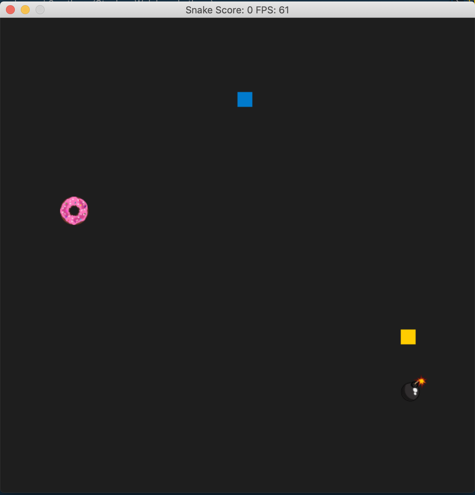
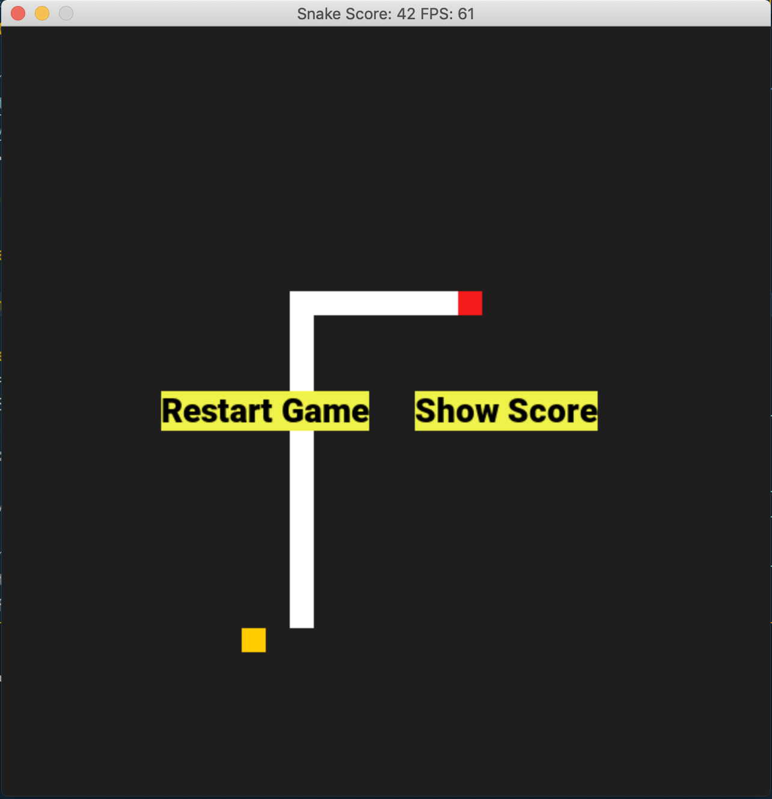
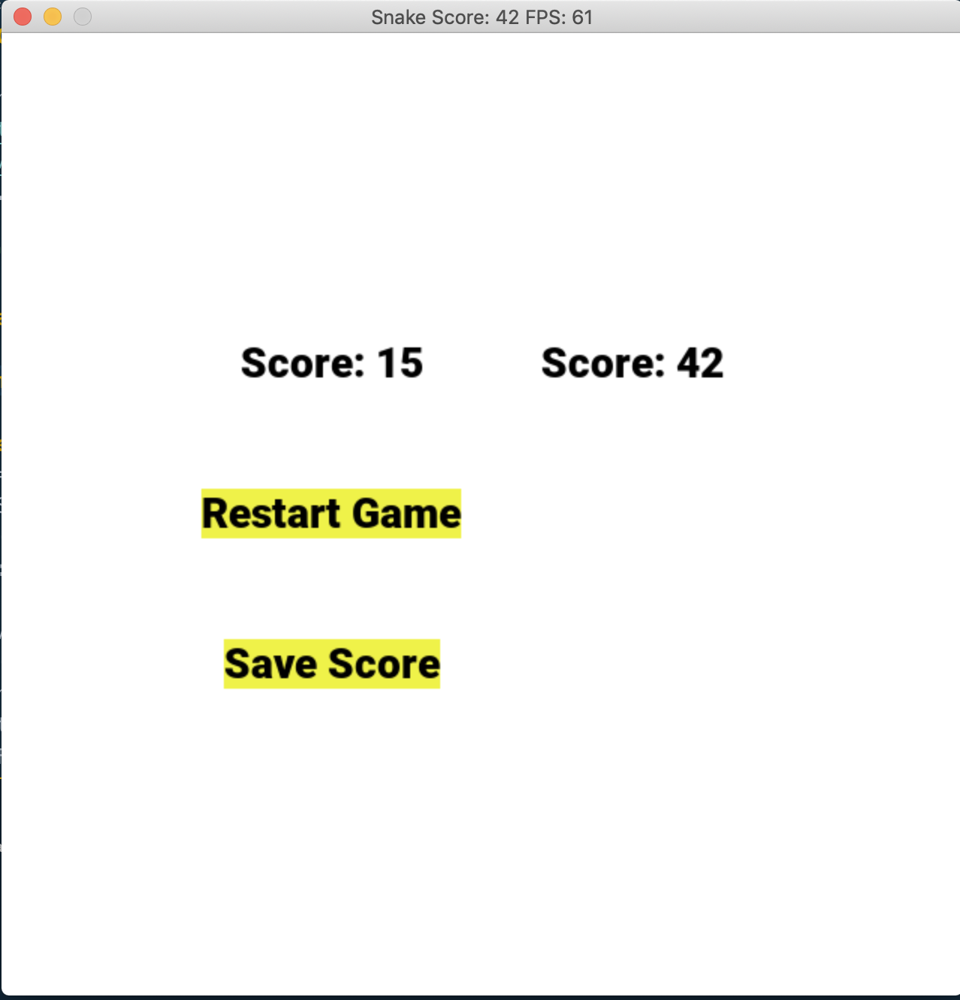
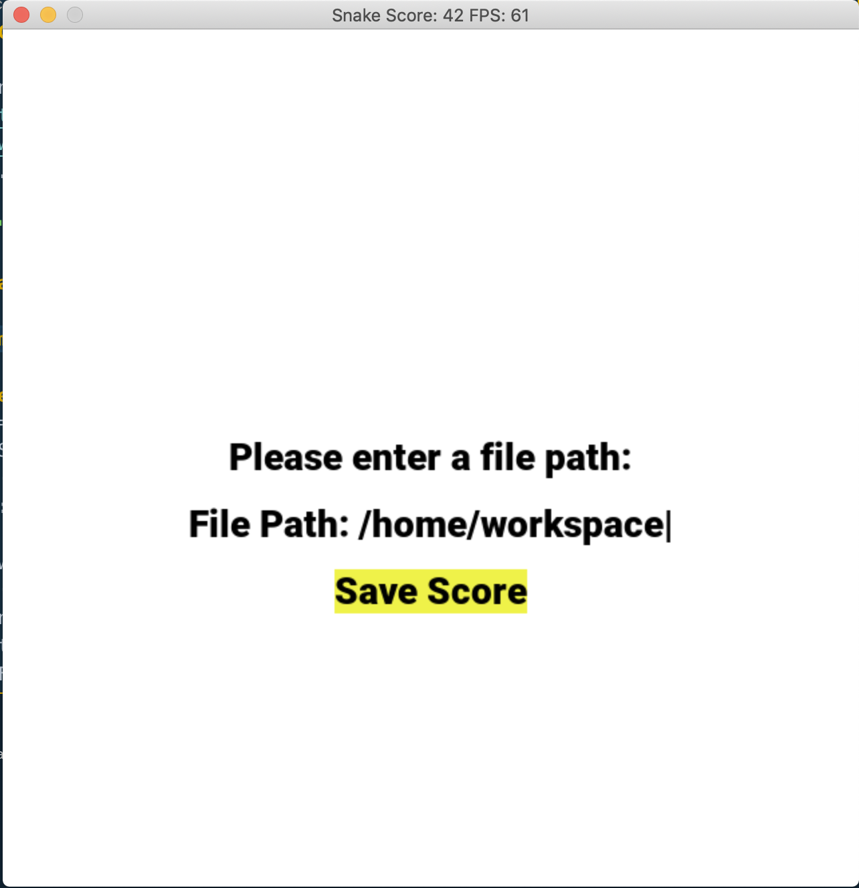

# CPPND: Capstone **Enhanced** Snake Game

This is an Enhanced version of the starter Snake Game supplied by [Udacity C++ Nanodegree Program](https://www.udacity.com/course/c-plus-plus-nanodegree--nd213). The udacity project was inspired by [this](https://codereview.stackexchange.com/questions/212296/snake-game-in-c-with-sdl) excellent StackOverflow post and set of responses.






## Description

This **enhanced** version supplies a number of extra features to the standard Snake game. Running this program should open a new Snake Game window where you'll be able to play.

The new version utilizes new classes to help organize the game. The enhanced version also uses the SDL_ttf and SDL_image libraries to allow showing text and images on the screen.

### New Features
* **Snakes *love* donuts!** Eating a donut causes the snake to grow more and move faster than normal food.
* **Snakes *hate* bombs.** Eating a bomb cause the game to instantly end.
* **Restart Game** A restart game button was added so the player won't have to re-run the program each time they die.
* **Show Score** Added a show score button that renders a new Score Screen.
* **Save Score** Added a feature where the the player can save their score to a file. By default the file is saved into the same directly where the program was run. The user can add a path to their own save directory. Old scores are not removed when new scores are added.

## Rubric Points Met

* **Loops, Functions, I/O** *-A variety of control structures are used in the project-*
  - The program utilizes switches and while loops. /File: `game.cpp` line: 56/,  /File: `obstacle.cpp` line: 96/
* **Loops, Functions, I/O** *-The project code is clearly organized into functions.-*
  - Care was taken to make sure that large files like `renderer.cpp` were broken into smaller, more reusable functions. /File: `renderer.cpp` line: 179/,  /File: `renderer.cpp` line: 207/, /File: `renderer.cpp` line: 219/
* **Loops, Functions, I/O** *-The project reads data from an external file or writes data to a file as part of the necessary operation of the program.-*
  - The program uses `<fstream>` to write scores to a file. It reads in image files with SDL_Image. It also reads in a font file with SDL_ttf. /File: `Helpers.cpp` line: 51/,  /File: `obstacle.cpp` line: 89/
* **Loops, Functions, I/O** *-The project accepts input from a user as part of the necessary operation of the program.-*
  - The program takes user input from mouseclicks and keyboard events. Mouseclicks allow buttons to be tapped. Keyboard events allow for adding the users own file path. /File: `controller.cpp` line: 47/,  /File: `controller.cpp` line: 68/
* **Object Oriented Programming** *-The project code is organized into classes with class attributes to hold the data, and class methods to perform tasks.-*
  - The program is split up into a number of new classes. Classes like Texture and it's Inheritor - Obstacle - allow for logic to be encapsulated and reused. The program also has a struct - RandomPoint - that encapsulates logic but didn't need to be a full blown class. The program uses Enums as well. /File: `texture.cpp` line: 1/, /File: `obstacle.cpp` line: 1/, /File: `button.cpp` line: 1/, /File: `Helpers.cpp` line: 9/, /File: `Helpers.h` line: 8/


## Class and Program Structure

### Class and file descriptions
- **main.cpp** - This starts the entire program and setups of the environment.

- **controller.cpp** - This handles user input and user interaction with the game. Through SDL it continuously polls for user input events.

- **game.cpp** - This is the heart of the programs logic. It handles the games state as well as sending commands to the SDL_Renderer.

- **renderer.cpp** - This is the major class that setups how objects are rendered to the screen.

- **texture.cpp** - This is the base class for rendered textures and is used for rendering obstacles and text to the screen.

- **obstacle.cpp** - This inherits functionality from Texture and expands on the specifics of how obstacles are loaded and rendered. It also has a static function to help check for collisions of game objects.

- **button.cpp** - This is a simple class that encapsulates data for the game interactive buttons.

- **snake.cpp** - This is the class that encapsulates the behavior and data for the Snake.

- **Helpers.cpp** - This is a Helper file that contains the RandomPoint struct, writeScoreFile function and MouseActionButtons enum.

### General flow and structure
```
-- **main.cpp**

    -- **controller.cpp**

    -- **game.cpp**

        -- **button.cpp**

        -- **snake.cpp**

        -- **renderer.cpp**

            -- **texture.cpp**

                -- **obstacle.cpp**

        -- **Helpers.cpp**
```

## Dependencies for Running Locally
* cmake >= 3.7
  * All OSes: [click here for installation instructions](https://cmake.org/install/)
* make >= 4.1 (Linux, Mac), 3.81 (Windows)
  * Linux: make is installed by default on most Linux distros
  * Mac: [install Xcode command line tools to get make](https://developer.apple.com/xcode/features/)
  * Windows: [Click here for installation instructions](http://gnuwin32.sourceforge.net/packages/make.htm)
* SDL2 >= 2.0
  * All installation instructions can be found [here](https://wiki.libsdl.org/Installation)
  * Note that for Linux, an `apt` or `apt-get` installation is preferred to building from source.
* SDL2_TTF  >= 2.0
  * Instructions [here] (https://www.libsdl.org/projects/SDL_ttf/)
  * Note that for Linux, an `apt` or `apt-get` installation is preferred to building from source.
* SDL2_Image  >= 2.0
  * Instructions [here] (https://www.libsdl.org/projects/SDL_image/)
  * Note that for Linux, an `apt` or `apt-get` installation is preferred to building from source.
* gcc/g++ >= 5.4
  * Linux: gcc / g++ is installed by default on most Linux distros
  * Mac: same deal as make - [install Xcode command line tools](https://developer.apple.com/xcode/features/)
  * Windows: recommend using [MinGW](http://www.mingw.org/)

## Basic Build Instructions

1. Clone this repo.
2. Install CMAKE version >= 3.7. Use instructions to upgrade [here](https://apt.kitware.com/) and [here](https://askubuntu.com/questions/355565/how-do-i-install-the-latest-version-of-cmake-from-the-command-line#answer-1157132). MacOS users should install with [Homebrew](https://brew.sh/). Here are the instructions for Ubuntu 16.0.4:
  * `wget -O - https://apt.kitware.com/keys/kitware-archive-latest.asc 2>/dev/null | sudo apt-key add -`
  * `sudo apt-add-repository 'deb https://apt.kitware.com/ubuntu/ xenial main'`
  * `sudo apt-get update`
  * `sudo apt-get --only-upgrade install cmake=3.15.2-0kitware1`
3. install SDL2_image and SDL2_ttf. [here](https://lazyfoo.net/tutorials/SDL/06_extension_libraries_and_loading_other_image_formats/linux/index.php). MacOS users should install with [Homebrew](https://brew.sh/). Here are the instructions for Ubuntu 16.0.4:
  * `apt-get install libsdl2-image-dev`
  * `apt-get install libsdl2-ttf-dev`
4. Use the appropriate `CMakeLists.txt` file. For example on Ubuntu 16.0.4 replace `CMakeLists.txt` with `CMakeLists_ubuntu_16.txt`.
5. Make a build directory in the top level directory: `mkdir build && cd build`
6. Compile: `cmake .. && make`
7. Run it: `./SnakeGame`.

## Credits

Credits are due to the resources I used to help build the program:

* For the initial project: [Udacity C++ Nanodegree Program](https://www.udacity.com/course/c-plus-plus-nanodegree--nd213) and [this](https://codereview.stackexchange.com/questions/212296/snake-game-in-c-with-sdl)
* For help with the SDL library and general Game Programming: [LazyFoo](http://lazyfoo.net/tutorials/SDL/index.php)
  * http://www.lazyfoo.net/tutorials/SDL/10_color_keying/index.php/
  * http://www.lazyfoo.net/tutorials/SDL/16_true_type_fonts/index.php/
  * http://lazyfoo.net/tutorials/SDL/32_text_input_and_clipboard_handling/index.php
* For the open source sprites:
  * bomb - [Cartoon bomb |		Public domain vectors](https://publicdomainvectors.org/en/free-clipart/Cartoon-bomb/49746.html)
  * donut -  [Stars and sprinkles donut |		Public domain vectors](https://publicdomainvectors.org/en/free-clipart/Stars-and-sprinkles-donut/67075.html)
* For help with c++ troubleshooting, SDL installation, and many other bugs [StackOverflow](https://stackoverflow.com/)